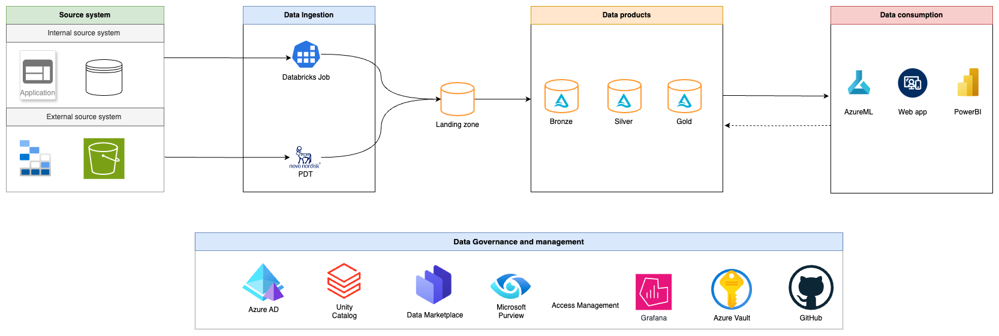
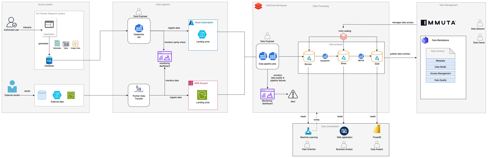
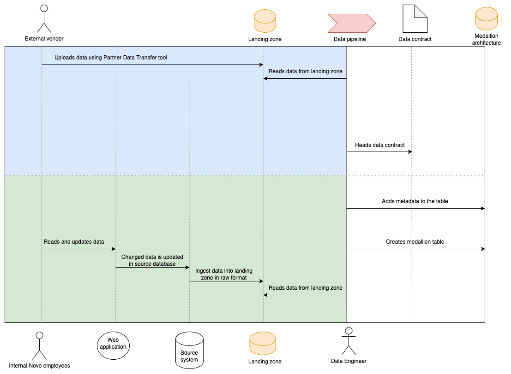

# Solution Architecture for {{cookiecutter.project_name}}

- Solution architecture of {{cookiecutter.project_name}} consists of:
  - [High level architecture](#high-level-architecture)
  - [Data architecture](#data-architecture)
  - [Model architecture](#model-architecture)(for AI products only)
  - [Data flow architecture](#data-flow-architecture)

## High level architecture
The high-level architecture provides a comprehensive overview of {{cookiecutter.project_name}}, illustrating its journey from origin to consumption.

## Data Architecture

Data Architecture highlights:

- **Data sources and formats:** Overview of the various input sources (e.g., databases, APIs) and the formats (e.g., JSON, CSV) used for storing data, ensuring compatibility for effective integration.

- **Hub and spoke topology:** A centralized architecture where a main hub connects to multiple spokes (subsidiary systems), promoting efficient data distribution and improved organizational scalability. [Learn more](./../../07-data-ops/dataops.md)

- **Integration with data foundation:** Assessment of how the architecture interfaces with data foundation of the respective domains.

- **Medallion architecture:** A structured data management approach that categorizes data into layers (bronze for raw data, silver for processed data, gold for high-quality data), facilitating enhanced data analytics and management.

- **Data governance:** Implementation of policies and procedures that manage data availability, usability, integrity, and security, ensuring compliance and promoting best practices in data handling.

- **Data quality:** Strategies and measures focused on maintaining the accuracy, consistency, and reliability of data throughout its lifecycle, to enhance overall decision-making processes.

- **Unity Catalog integration:** Leveraging Unity Catalog for centralized data governance and management, enabling efficient access control, data discovery, and collaboration across teams and domains.

### Data Architecture Diagram  

## Model architecture
The model architecture defines the structure and components of AI/ML systems, encompassing algorithms, data processing, and model training for efficient and accurate predictions. Key considerations include scalability, modularity, interoperability, and performance to ensure robust and effective solutions. This is valid for AI products only. 
TODO: Update Model architecture diagram

## Data flow architecture 
Data flow defines the movement and transformation of data within a system. It outlines how data is collected from various sources, processed through different stages, and eventually delivered to end-users or applications.

**Note:** This flow focuses exclusively on the data product until bronze layer. It can be expanded to illustrate a more detailed medallion architecture, including the data consumption flow.
